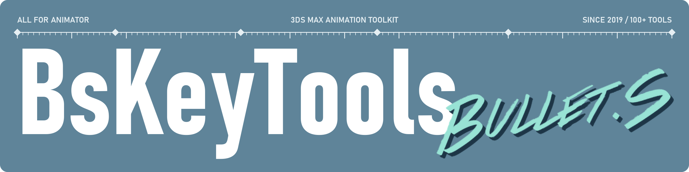

[**下载**](https://github.com/AniBullet/BsKeyTools/releases/latest) | [**帮助文档**](https://anibullet.github.io/) | [**视频教程**](https://space.bilibili.com/2031113/lists/560782?type=season) | [**更新日志**](https://github.com/AniBullet/BsKeyTools/releases) | [English](#english) 
QQ 群 [993590655](https://jq.qq.com/?_wv=1027&k=hmeHhTwu) · [907481113](https://qm.qq.com/q/FZ2gBKJeYE) | [AniBullet.com](https://www.anibullet.com/) | [DeepWiki](https://deepwiki.com/AniBullet/BsKeyTools) | [社交链接](https://bio.site/aniBullet)

面向 3ds Max 动画师的免费工具集，100+ 常用工具集中在一个可停靠面板里。

  

  <i>主面板与功能配置，按钮可自由排序</i>

## 亮点

- **一个面板**：横竖停靠、图标/文字切换，按钮自由排序
- **动画重定向**：FBX 与 Biped 互转，内置 UE5、只狼、鬼泣5 等映射预设
- **关键帧与轨迹**：补间、镜像、烘焙、帧范围，轨迹编辑与 Root Motion
- **绑定与蒙皮**：Biped、飘带、扭曲骨骼、弹簧，权重平滑与蒙皮换骨
- **视口与参考**：GhostTrails 残影、AnimRef 视频参考、剪影、洋葱皮
- **游戏动作导入**：RE 引擎、Havok、ActorX、XPS，批量转 FBX
- **场景安全**：自动备份、图层管理、批量重命名，脚本病毒实时查杀
- **开箱即用**：支持 3ds Max 2014–2026，中英双语，自动检查更新

完整工具清单见 [TOOLS_STATISTICS.md](TOOLS_STATISTICS.md)。

## 安装

1. 从 [Releases](https://github.com/AniBullet/BsKeyTools/releases/latest) 下载 `BsKeyTools.exe`
2. 运行安装程序，勾选要安装的 3ds Max 版本（自动检测本机已安装的版本）
3. 启动 3ds Max，从菜单栏 **BsKeyTools** 打开工具

| 安装包 | 内容 |
|:---|:---|
| `BsKeyTools.exe` | 全功能插件（推荐） |
| `BsCleanVirus.exe` | 仅脚本病毒查杀 |

GitHub 下载慢可以用国内网盘：

| 网盘 | 提取码 |
|:---|:---|
| [蓝奏云](https://anibullet.lanzouw.com/b07cmnqta) | `2333` |
| [阿里云盘](https://alipan.com/s/tFUkG2D9Z9J) | 无 |
| [夸克网盘](https://pan.quark.cn/s/4a0d183b53c5) | `x8Ee` |
| [百度网盘](https://pan.baidu.com/s/1WZLgXLid_ga9N-RNPI4N4Q?pwd=2333) | `2333` |

安装演示与手动安装

 

  

  

## 截图

<table>
<tr>
<td align="center" valign="top"> 主面板</td>
<td align="center" valign="top"> BsRetargetTools：FBX 转 Biped 与动画重定向</td>
</tr>
</table>

更多截图

 
<table>
<tr>
<td align="center"> 图标模式</td>
<td align="center"> 竖向停靠</td>
</tr>
<tr>
<td align="center" colspan="2"> 横向停靠</td>
</tr>
<tr>
<td align="center"> 菜单栏入口</td>
<td align="center"> 设置菜单</td>
</tr>
</table>

## 参与贡献

欢迎报告 Bug、提出建议或提交代码，详见 [CONTRIBUTING.md](CONTRIBUTING.md)。

- 问题与建议：提交 [GitHub Issues](https://github.com/AniBullet/BsKeyTools/issues)
- Fork 本仓库，创建 `feature/xxx` 分支
- 向 [`dev`](https://github.com/AniBullet/BsKeyTools/tree/dev) 分支发起 Pull Request，`main` 随正式版更新

## 致谢

开源项目：[FFmpeg](https://github.com/FFmpeg/FFmpeg)（多媒体处理）· [gifsicle](https://eternallybored.org/misc/gifsicle/)（GIF 优化）

社区贡献者（不完全统计，排名不分先后）：

Crazyone · 包包 · 东见云 · 祥子 · SiChun Yuan · 动画大白 · 哈库呐玛哒哒 · z.ven 子墨 · 一方狂三 · 夏奈 · 虹 · CG大猫哥

感谢每一位反馈建议和提交代码的伙伴。

## Star 历史

<a href="https://www.star-history.com/?repos=AniBullet%2FBsKeyTools&type=date&legend=top-left">
 <picture>
   <source media="(prefers-color-scheme: dark)" srcset="https://api.star-history.com/chart?repos=AniBullet/BsKeyTools&type=date&theme=dark&legend=top-left&sealed_token=HzRaUrVdn0YfV0zbeaUmdb9pHZKRyg3RTlw7-lDYxHDA_UD37r-ZGegaiNPpASioI_Tsxx6OSi5_NBO8kcfxbRMhbuWSNjWKUF3RuhG06B7yduPuQ8jCh2UuE4ftvWz4In-SDDluYIJZWvF2bReHDCWaRnFvYC4-xT-EswU69jkw8eMTNtxiAFVNRA3Q" />
   <source media="(prefers-color-scheme: light)" srcset="https://api.star-history.com/chart?repos=AniBullet/BsKeyTools&type=date&legend=top-left&sealed_token=HzRaUrVdn0YfV0zbeaUmdb9pHZKRyg3RTlw7-lDYxHDA_UD37r-ZGegaiNPpASioI_Tsxx6OSi5_NBO8kcfxbRMhbuWSNjWKUF3RuhG06B7yduPuQ8jCh2UuE4ftvWz4In-SDDluYIJZWvF2bReHDCWaRnFvYC4-xT-EswU69jkw8eMTNtxiAFVNRA3Q" />
   
 </picture>
</a>

## English

A free animation toolkit for 3ds Max 2014–2026: 100+ tools in one dockable panel.

- **Retargeting**: FBX ↔ Biped with presets for UE5, Sekiro, DMC5 and more
- **Keyframes**: tweening, mirroring, baking, motion trails, Root Motion
- **Rigging & skinning**: Biped tools, ribbons, twist bones, skin weights
- **Viewport**: GhostTrails, AnimRef video reference, onion skin, silhouette
- **Game import**: RE Engine, Havok, ActorX, XPS, batch export to FBX
- **Scene safety**: auto backup, batch rename, MaxScript malware scanner

Download `BsKeyTools.exe` from [Releases](https://github.com/AniBullet/BsKeyTools/releases/latest), run it, then open **BsKeyTools** from the 3ds Max menu bar.

## 许可与声明

- 本人编写的代码以 [MIT License](LICENSE) 授权
- 第三方脚本与插件版权归原作者所有，均已注明出处
- 第三方部分请遵守原作者条款，未经许可请勿商用
- 个人业余学习作品，免费开源，若有侵权请联系删除
- 转载或修改工具请注明作者和来源

---

Since 2019.11 · © 2019–2026 Bullet.S · [回到顶部](#readme-top)
